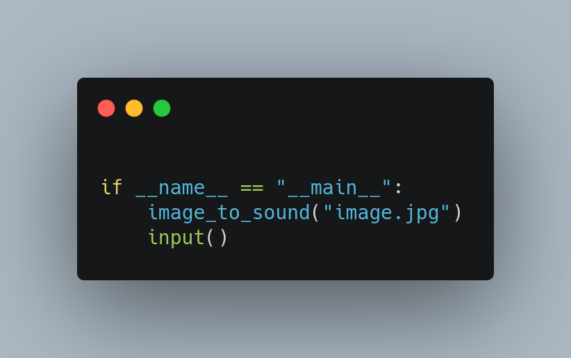

# image-to-sound-python-

How to run 
------------
By default the script will load an image with name **image.jpg** from its current directory
to change it adjust the it to be the your new image name.

Explore it 
-----------
Now keep explore it by testing it with various input picture to see what kinda of sound it produces 

Give it a star 
--------------
Did you find this information useful, then give it a star 